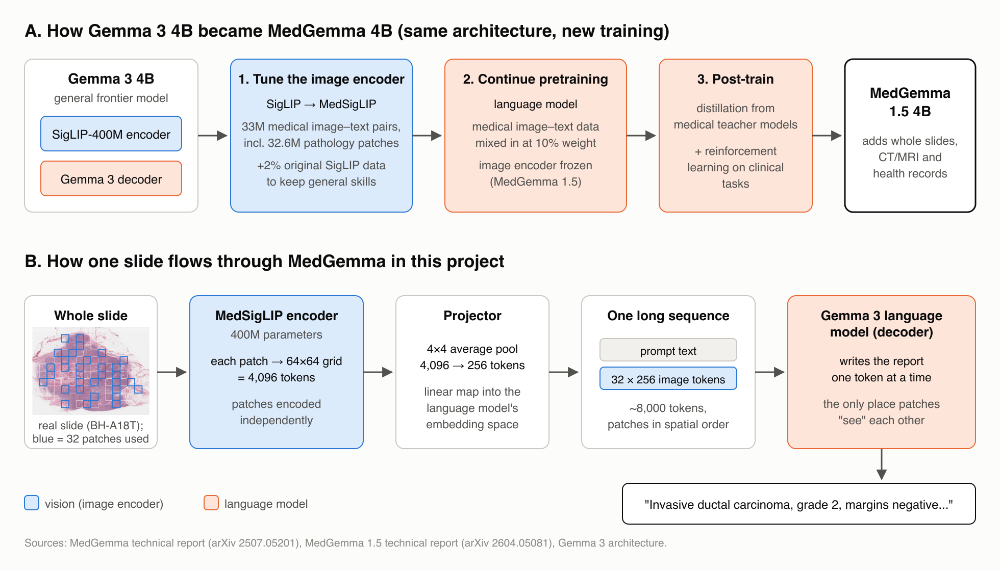
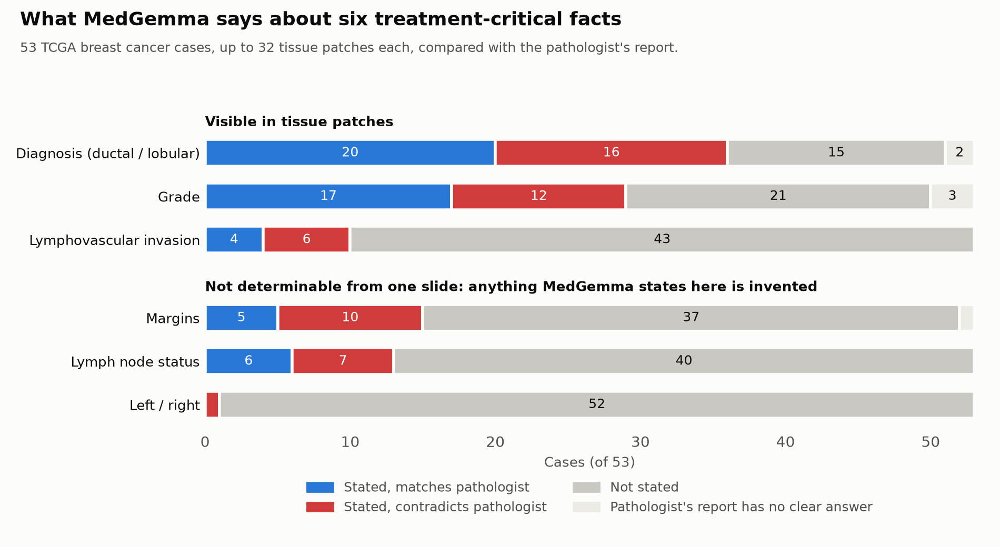
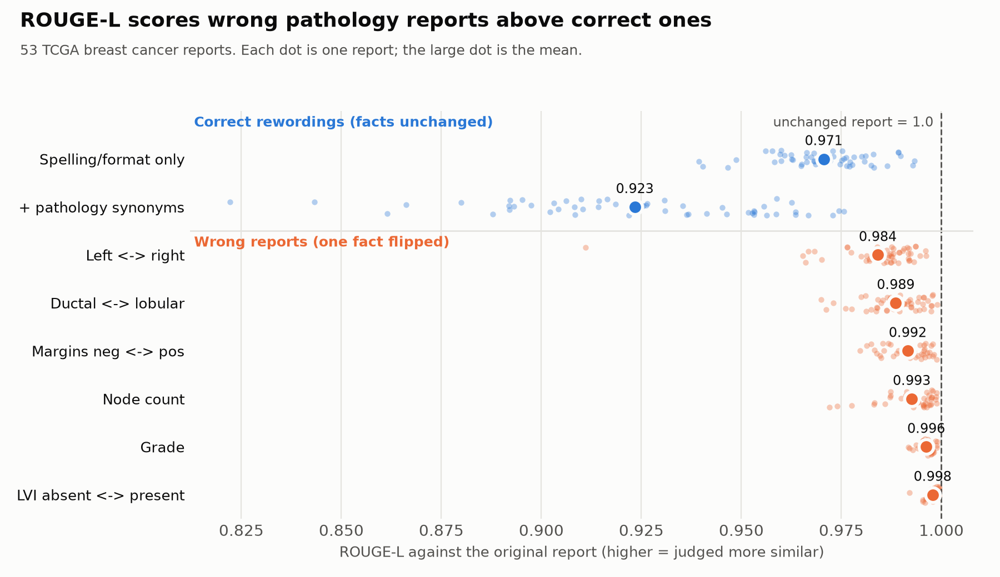
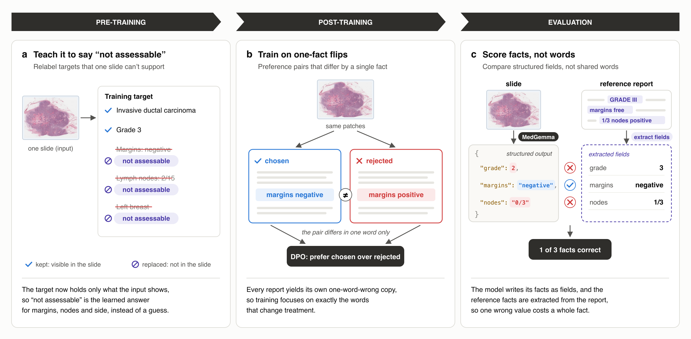

## The blind spot

During my seventh semester, I spent a few weeks working in my LLM instructor's lab under his supervision. My task was to map the landscape of whole-slide pathology imaging and survey the literature for gaps. Reading through recent MICCAI papers, I noticed a pattern: the models kept getting better at identifying findings and generating reports, but the metric used to score those reports itself was flawed. It measured how closely the generated text matched the pathologist's wording, not whether the report was correct, so hallucinations and factual errors went unnoticed in a domain where a single wrong word can change a patient's treatment.

My time at the lab ended there, and I never got to work on the idea. This challenge gave me the opportunity to pick it up where I left off.

> **A note on my background.** I am not a histopathologist. I am an ML/DL researcher who worked on report generation from whole-slide images in earlier research, and that is where the idea for this project comes from. The pathology details in this write-up, such as which facts matter clinically, how they are graded in the clinical domain and what the terms mean, were worked out with the help of an AI assistant and checked against published sources where I could.

## Summary

Given tissue from a breast cancer slide, MedGemma writes a confident pathology report and fills in facts it has no way of knowing. The metric its model card uses for these reports, ROUGE, can't tell.

- **The model gets critical facts wrong.** When MedGemma states a fact that decides treatment, it contradicts the pathologist 41 to 67% of the time.
- **The metric can't see it.** I took real pathologist reports and made two copies of each. One reworded but still correct, one with a single fact flipped. ROUGE-L gave the wrong copy the higher score in 92 to 100% of cases (Exp 2a).
- **Fixing the errors doesn't register.** Correcting every contradicted fact in MedGemma's reports moves ROUGE-L by +0.006 on average, and in 11 of 37 reports the corrected version scores lower (Exp 2b).

## Model Choice

I evaluate MedGemma 1.5 4B (`[google/medgemma-1.5-4b-it](https://huggingface.co/google/medgemma-1.5-4b-it)`), used as released. The weights are not included here because they are gated behind Google's terms of use; the link above is the exact model.

Why MedGemma:

- It is built on Gemma 3, Google's open frontier model family, and adapted to medical text and images. So it shows how a current frontier model behaves once it is specialised for a domain.
- Its image encoder saw histopathology, microscope images of tissue, during training. If it fails on tissue, it isn't because it has never seen tissue.
- Its model card reports one number for whole-slide pathology reports. That number is WSI-Path, 49.4, up from 2.2 for MedGemma 1, and it is scored with ROUGE only. Chest X-ray reports on the same card get RadGraph F1, a metric built on clinical facts. So the model's headline pathology result comes from exactly the metric I test in Exp 2. A whole-slide image (WSI) is a gigapixel scan of one glass tissue slide.

### How MedGemma is built

*Figure 1. MedGemma: how it was adapted from Gemma 3 (A) and how one slide flows through it in this project (B).*

MedGemma keeps Gemma 3's architecture; only the training changed (A). At inference (B), each patch is encoded on its own, so the language model is the only part that combines evidence across patches. It is also where the language prior that fills the report template lives, which matters for Exp 1.

## Data

|         | Source                                                                                                                           | License     |
| ------- | -------------------------------------------------------------------------------------------------------------------------------- | ----------- |
| Reports | TCGA-Reports (Kefeli et al. 2024), 9,523 OCR'd pathology reports from The Cancer Genome Atlas (TCGA), a public US cancer dataset | CC BY 4.0   |
| Slides  | TCGA-BRCA (the breast cancer part of TCGA) diagnostic slides, NCI Genomic Data Commons                                           | Open access |

*Table 1. Data sources.*

I kept one organ, breast, so the same six facts apply to every case. Of 1,062 breast cancer patients with an open slide, 53 have a report that states all six facts (Table 2), is a reasonable length and has little OCR noise. The reference text is the report's final diagnosis section, which is what WSI-Path scores. 33 of the 53 reports have a detectable section; the other 20 use the full report.

For all 53 cases I cut patches the way MedGemma's technical report describes: 896 px patches on a grid over the tissue, randomly subsampled to a cap and kept in spatial order. I use 5x, one of Google's three magnifications, because each patch then covers about 1.8 mm of tissue, so the cap covers most of a slide. I cut up to 64 patches per slide (Google's cap is 126). Every experiment uses the same 53 cases.

## What counts as an error

| Fact                          | What it means                                                                                  | Example flip         | Determinable from one slide? |
| ----------------------------- | ---------------------------------------------------------------------------------------------- | -------------------- | ---------------------------- |
| Diagnosis                     | The cancer type. Ductal and lobular are the two main breast cancer types                       | ductal to lobular    | Yes                          |
| Lymphovascular invasion (LVI) | Cancer cells inside blood or lymph vessels, a sign it can spread                               | absent to present    | Sometimes                    |
| Margins                       | Whether cancer reaches the cut edge of the removed tissue. Positive means some was left behind | negative to positive | No                           |
| Lymph node count              | How many nearby lymph nodes contain cancer                                                     | 0/3 to 1/3           | No                           |
| Grade                         | How abnormal the cancer cells look, from 1 (close to normal) to 3                              | 2 to 3               | Yes                          |
| Laterality                    | Left or right breast                                                                           | left to right        | No                           |

*Table 2. The six treatment-critical facts checked in every report.*

The last column matters for Exp 1. Laterality isn't in the tissue at all, lymph nodes are on other slides, and margin status needs every edge of the removed tissue, not one slide. So any value the model states for these three is invented.

## Experiment 1: MedGemma states facts it can't know

### Setup

The pre-processing pipeline is mentioned under Data where I mention in detail how the patching happens. All patches of a case go into one prompt with the instruction "These are tissue patches from one H&E slide of a breast surgical specimen, in spatial order. Write the FINAL DIAGNOSIS section of the pathology report." Decoding is greedy, up to 400 new tokens.

I ran inference on my own RTX 5070 (12 GB) in bf16, the model's native precision. My first run used 64 patches per slide and ran out of GPU memory. MedGemma's image encoder (SigLIP) processes every image in the prompt as one batch, and its MLP activation of shape (images, 4096, 4304) alone needs about 2 GB at 64 images. Two changes made it fit. I encode the images 4 at a time and concatenate the results; SigLIP encodes each image independently, so the language model receives exactly the same image tokens. And I cap each slide at 32 patches, picked evenly across the 64 so they still span the whole slide. That is a quarter of Google's cap of 126. Slides with little tissue have fewer patches: 38 of the 53 cases used 32, the rest 6 to 31.

### Scoring

Extracting facts from MedGemma's free text with keyword rules would be unreliable. So the facts were annotated by reading. For every case I recorded, per fact, what the pathologist reported, what MedGemma stated, and a verdict, together with MedGemma's exact words as evidence (`results/04_annotations.csv`, 318 fact rows). The first pass was done with Claude Opus reading each generated report next to the reference and I then read 10 cases against the quotes to cross-check and they looked fine.

### Results

*Figure 2. Each bar is one fact across the 53 cases. Blue: MedGemma states it and matches the pathologist. Red: states it and contradicts the pathologist. Gray: doesn't state it. Light gray: the pathologist's report has no clear answer.*

When MedGemma states one of these facts, it is wrong 41 to 67% of the time. Margins are the worst. It gives a margin status in 15 cases, although one slide can't show it, and 10 of those are wrong. Most of them say the tumour reaches the edge of the removed tissue, which would mean cancer was left behind and the patient needs another operation.

### What else MedGemma does

Reading the reports also shows failure modes that any ML reader will recognise.

| Failure mode                                | Cases | What it looks like here                                                                                                                                   |
| ------------------------------------------- | ----- | --------------------------------------------------------------------------------------------------------------------------------------------------------- |
| Degenerate repetition under greedy decoding | 15    | One sentence repeated up to 26 times until the token limit                                                                                                |
| Misses the main finding                     | 8     | Calls a cancer benign: "Fibroadenoma."                                                                                                                    |
| States facts that aren't in the input       | 8     | A full cancer stage (T = tumour size, N = lymph nodes, M = spread to other organs), which needs scans and other slides the model never saw: "T4 N1(c) M0" |
| States results of tests it can't see        | 7     | Lab test results that need extra staining, not an image like these: "The tumor is triple negative."                                                       |
| Invents the worst-case outcome              | 4     | Says the cancer has spread to other organs: "T4 N0 M1"                                                                                                    |
| Claims inputs it never had                  | 4     | "based on clinical information provided", when the prompt had none                                                                                        |
| Leaks text from a neighbouring domain       | 4     | A mammography score in a pathology report: "BI-RADS Category 5:"                                                                                          |

*Table 3. Other failure modes found while reading MedGemma's 53 reports.*

Each case and its quote is listed in `results/04_annotations.csv` (rows marked "observed"); repetition loops are counted from the raw outputs.

Together with the results above, this points to one blind spot. MedGemma writes the report its language prior expects for a breast cancer case, and fills every section of that template whether or not the image supports it. The critical facts are exactly where this shows up, and they are one or two words long.

## Experiment 2: Why nobody notices

Exp 1 shows MedGemma getting treatment-critical facts wrong, yet its model card reports steady progress on whole-slide reports: WSI-Path went from 2.2 to 49.4, scored with ROUGE. This experiment tests whether ROUGE can see these errors at all, in two directions: flipping facts in the pathologists' own reports (2a), and fixing facts in MedGemma's reports (2b).

### 2a. ROUGE prefers a one-fact flip over a correct rewording

I took each of the 53 reference reports from the dataset (`data/00_cases.csv`) and made two kinds of variants.

- Correct rewordings. A light one changes only spelling and format ("tumor" to "tumour", "one" to "1"). A fuller one also swaps pathology synonyms ("infiltrating" for "invasive", "not seen" for "not identified").
- Wrong reports. Each one flips a single fact from the error table, everywhere it appears.

Then I scored every variant against the original with ROUGE-L (BLEU as a side check).

An unchanged report scores ROUGE-L 1.000 against itself. The table shows the score after each kind of change. "Reports affected" is how many of the 53 reports state that fact in a form the rules can flip, which is why it varies.

| Variant                         | Correct? | Reports affected | Phrases changed (avg) | ROUGE-L | Wrong report beats a correct rewording |
| ------------------------------- | -------- | ---------------- | --------------------- | ------- | -------------------------------------- |
| Spelling/format only            | Yes      | 52               | 10.6                  | 0.971   |                                        |
| + pathology synonyms            | Yes      | 53               | 22.0                  | 0.923   |                                        |
| Lymphovascular invasion flipped | No       | 28               | 1.3                   | 0.998   | 100%                                   |
| Grade flipped                   | No       | 31               | 1.4                   | 0.996   | 98%                                    |
| Node count flipped              | No       | 43               | 2.0                   | 0.993   | 99%                                    |
| Margins flipped                 | No       | 37               | 1.9                   | 0.992   | 100%                                   |
| Ductal/lobular flipped          | No       | 52               | 3.6                   | 0.989   | 94%                                    |
| Left/right flipped              | No       | 53               | 4.9                   | 0.984   | 92%                                    |

*Table 4. ROUGE-L after each kind of change to the 53 pathologist reports. An unchanged report scores 1.000.*

*Figure 3. ROUGE-L for correct rewordings (blue) and one-fact flips (orange). Each dot is one report.*

The "phrases changed" column explains the result. ROUGE-L drops in proportion to how many words change, not to what they mean. A flip touches one or two words, so it barely moves the score. A correct rewording touches ten or more, so it loses more. Writing "tumour" instead of "tumor" costs more ROUGE-L than calling negative margins positive. Every flipped fact scores higher on average than either correct rewording, and in 92 to 100% of same-report pairs ROUGE-L prefers the wrong report.

### 2b. Fixing MedGemma's own errors doesn't move ROUGE

For each of the 52 facts MedGemma contradicted in Exp 1 (in 37 reports), I made the smallest edit that makes the claim match the pathologist, for example "N1" to "N0" or "moderately" to "poorly differentiated", everywhere the claim appears. The edits are listed in `results/05_corrections.csv`. Then I scored MedGemma's report as written and the corrected report against the pathologist's report.

|                                      | ROUGE-L | BLEU   |
| ------------------------------------ | ------- | ------ |
| MedGemma as written                  | 0.086   | 0.003  |
| After fixing every contradicted fact | 0.092   | 0.003  |
| Change                               | +0.006  | +0.000 |

*Table 5. Mean scores of MedGemma's 37 reports with a contradicted fact, before and after fixing those facts.*

Fixing every treatment-critical error raises ROUGE-L by 0.006 on average. In 11 of the 37 reports the corrected version scores lower than the wrong one. For scale, MedGemma's reports range from 0.030 to 0.175 ROUGE-L among themselves, so the difference between a report that sends a patient back to surgery and one that doesn't is lost in the noise of wording.

These ROUGE-L values are much lower than the 49.4 on Google's WSI-Path benchmark because the references differ: TCGA reports are long, OCR'd and full of template text, while WSI-Path uses its own curated final-diagnosis text. The absolute numbers aren't comparable. The point is the size of the change.

### What this means

2a and 2b look at the same blind spot from both sides. Near a perfect score, a wrong fact costs almost nothing; at MedGemma's real scores, a corrected fact gains almost nothing. A model can improve on ROUGE without getting a single margin, node or grade right, and it can get them all right without improving on ROUGE. So a WSI-Path score of 49.4 tells us how closely MedGemma copies pathologist wording, not whether its reports are correct, and the errors in Exp 1 stay invisible.

## Path forward

Two things need fixing: the model states facts its input can't support, and the metric can't tell. I propose one change at each stage of building the model, all cheap enough for a 4B model: what it is pre-trained on (a), how it is post-trained (b), and how it is evaluated (c). The evaluation change matters most, because without it the gains from a and b would not show up in any score.

*Figure 4. The three proposed changes. a: training targets keep only what the slide shows and say "not assessable" for the rest. b: DPO on report pairs that differ by one fact. c: MedGemma writes its facts as a structured output, the same facts are extracted from the pathologist's report, and the two are compared field by field instead of by shared words.*

**a. Pre-training: stop the data from teaching invention.** The model is trained to write a whole-case report from one slide, so it learns to guess facts the slide can't show. The fix:

- Run the fact extractor from c over every training report.
- For facts one slide can't show (margins, lymph nodes, laterality), replace the value with "not assessable from this slide".
- Pre-train on these relabelled reports. The model learns that the correct answer for those facts is to say it can't tell, and the third number in c measures whether it does.

**b. Post-training: train on one-fact flips.** Standard training barely separates "margins negative" from "margins positive", because the two reports differ by a single word. The fix:

- Run the Exp 2a generator on each training report to get a pair: the correct report and a copy with one fact flipped.
- Fine-tune with DPO on these pairs, with the slide's patches as input, so the model learns to prefer the correct report over the flipped one.
- DPO needs no separate reward model, and with LoRA it fits on a single GPU for a 4B model.

**c. Evaluation: score reports on facts, not words.** Replace ROUGE with a field-by-field check. Extract the facts from Table 2 (or the full CAP breast checklist pathologists already use) from both the generated and the reference report with an LLM, as done for Exp 1, and compare them one by one, the way RadGraph F1 already does for chest X-rays. Report three numbers instead of one:

- accuracy on facts a slide can show (diagnosis, grade, LVI),
- how often the model states facts a slide can't show (margins, nodes, laterality): MedGemma did so for margins in 15 of 53 reports and for nodes in 13,
- how often it correctly says "not assessable": MedGemma never did, for any of the six facts.

## Limitations

- MedGemma's model card lists TCGA among its training data, so it may have seen these slides or reports. Exp 2a doesn't involve the model, so this doesn't affect it.
- The reports were OCR'd from scanned PDFs and contain typos.
- The rewordings are mild. A real model's correct report would differ from the reference much more, so Exp 2a understates the problem.
- Random patches may contain no tumor. A tumor-targeted set would separate "can't see it" from "sees it and gets it wrong".
- MedGemma sees at most 32 patches at 5x per slide, fewer than Google's cap of 126 and at one magnification only, because of GPU memory.
- Exp 1 facts were annotated by an LLM (Claude) with verbatim evidence and partly reviewed by me, not by a pathologist. Some verdicts needed judgment, for example counting "high-grade carcinoma" as grade 3.

## Code

| File                               | What it does                                                                                                                                 |
| ---------------------------------- | -------------------------------------------------------------------------------------------------------------------------------------------- |
| `src/01_prepare_data.py`           | Downloads reports, selects cases (`data/00_cases.csv`), streams slides and cuts patches (`data/patches/`)                                    |
| `src/02_metric_paradox.py`         | Experiment 2a: flips and rewordings of the reference reports, writes `results/02_metric_paradox.csv` and `.png`                              |
| `src/03_generate_reports.py`       | Experiment 1: MedGemma writes a report per case from up to 32 patches (images encoded 4 at a time), writes `results/03_medgemma_reports.csv` |
| `src/04_fact_analysis.py`          | Experiment 1 scoring: counts `results/04_annotations.csv`, draws `results/04_fact_accuracy.png`                                              |
| `src/05_correct_and_rescore.py`    | Experiment 2b: fixes MedGemma's contradicted facts using `results/05_corrections.csv` and prints the rescored summary                        |
| `src/utils/plots.py`               | All charts, in one shared style                                                                                                              |
| `src/utils/dataset_download.ipynb` | Runs `01_prepare_data.py` on Colab's fast connection                                                                                         |

*Table 6. Scripts in* `src/` *and the experiment each belongs to.*