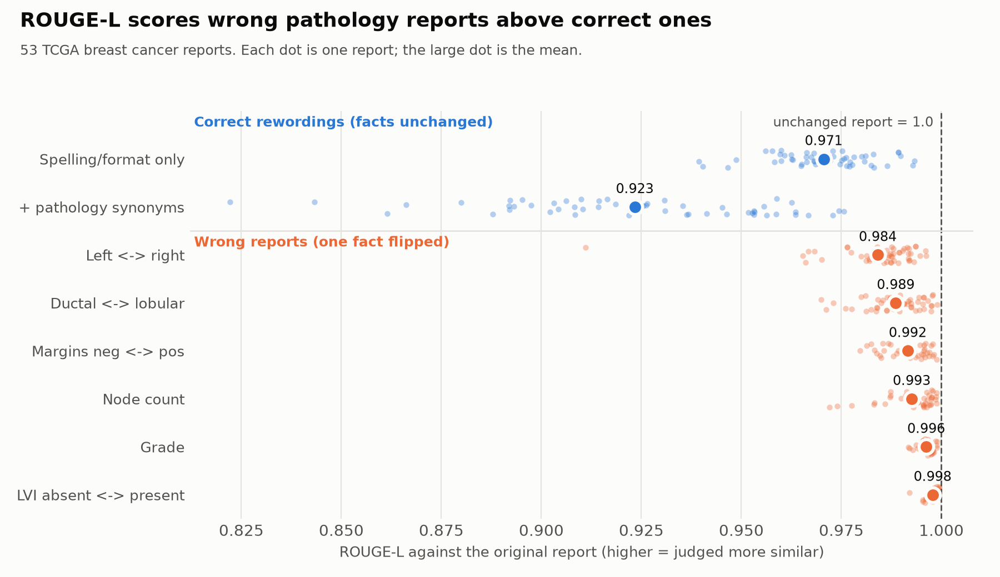

## Model

I evaluate MedGemma 1.5 4B (`google/medgemma-1.5-4b-it`), with Gemma 3 4B as a comparison.

Why MedGemma:

- It has 4B parameters, inside the 0.6B to 6B range.
- It is Google's medical version of Gemma 3, and its image encoder saw histopathology during training. If it fails on tissue, it isn't because it has never seen tissue.
- Its model card reports one number for whole-slide pathology reports. That number is WSI-Path, 49.4, up from 2.2 for MedGemma 1, and it is scored with ROUGE only. Chest X-ray reports on the same card get RadGraph F1, a metric built on clinical facts. So the model's headline pathology result comes from exactly the metric I test in Exp 1.
- It reads a whole slide as a set of patches. The technical report describes the pipeline: 896 px tissue patches on a grid, up to 126 per slide, kept in spatial order, at 5x, 10x or 20x. I copy that pipeline, so the test is fair to the model. (The card's limitations section still says multi-image use "has not been evaluated", which contradicts its own WSI feature; I don't rely on that sentence.)

Why Gemma 3 4B as a comparison: MedGemma is built on it. If the medical model writes more fluent reports but flips facts just as often, medical training improved style, not grounding.

## Data

|         | Source                                                                | License     |
| ------- | --------------------------------------------------------------------- | ----------- |
| Reports | TCGA-Reports (Kefeli et al. 2024), 9,523 OCR'd TCGA pathology reports | CC BY 4.0   |
| Slides  | TCGA-BRCA diagnostic slides, NCI Genomic Data Commons                 | Open access |

I kept one organ, breast, so the same six facts apply to every case. Of 1,062 breast cancer patients with an open slide, 53 have a report that states all six facts, is a reasonable length and has little OCR noise. The reference text is the report's final diagnosis section, which is what WSI-Path scores. 33 of the 53 reports have a detectable section; the other 20 use the full report.

For all 53 cases I cut patches the way MedGemma's technical report describes: 896 px patches on a grid over the tissue, randomly subsampled to a cap and kept in spatial order. I use 5x, one of Google's three magnifications, because each patch then covers about 1.8 mm of tissue, so the cap covers most of a slide. The cap is 64 patches instead of Google's 126, to fit a Colab GPU. Every experiment uses the same 53 cases. Status: patches are built on Colab.

## What counts as an error

| Fact                    | Example flip         | Severity | Visible in a tissue patch? |
| ----------------------- | -------------------- | -------- | -------------------------- |
| Diagnosis               | ductal to lobular    | Critical | Yes                        |
| Lymphovascular invasion | absent to present    | Critical | Sometimes                  |
| Margins                 | negative to positive | Critical | No                         |
| Lymph node count        | 0/3 to 1/3           | Critical | No                         |
| Grade                   | 2 to 3               | High     | Yes                        |
| Laterality              | left to right        | High     | No                         |

Severity is based on whether the fact changes staging or treatment, not on my own clinical judgment. I come to this as a deep learning researcher, not a pathologist. Node count sets the N stage in AJCC staging, and positive margins usually mean further surgery. These ratings still need checking against the CAP breast reporting protocol before submission.

The last column matters for Exp 2. Laterality, margins and node count can't be read off a breast tissue patch at all, so any value the model states for them is invented.

## Experiment 1: ROUGE can't see the error

I took each of the 53 reference reports and made two kinds of variants.

- Correct rewordings. A light one changes only spelling and format ("tumor" to "tumour", "one" to "1"). A fuller one also swaps pathology synonyms ("infiltrating" for "invasive", "not seen" for "not identified").
- Wrong reports. Each one flips a single fact from the table above, everywhere it appears.

Then I scored every variant against the original with ROUGE-L (BLEU as a side check).

An unchanged report scores ROUGE-L 1.000 against itself. The table shows the score after each kind of change. "Reports affected" is how many of the 53 reports state that fact in a form the rules can flip, which is why it varies.

| Variant                         | Correct? | Reports affected | Phrases changed (avg) | ROUGE-L | Wrong report beats a correct rewording |
| ------------------------------- | -------- | ---------------- | --------------------- | ------- | -------------------------------------- |
| Spelling/format only            | Yes      | 52               | 10.6                  | 0.971   |                                        |
| + pathology synonyms            | Yes      | 53               | 22.0                  | 0.923   |                                        |
| Lymphovascular invasion flipped | No       | 28               | 1.3                   | 0.998   | 100%                                   |
| Grade flipped                   | No       | 31               | 1.4                   | 0.996   | 98%                                    |
| Node count flipped              | No       | 43               | 2.0                   | 0.993   | 99%                                    |
| Margins flipped                 | No       | 37               | 1.9                   | 0.992   | 100%                                   |
| Ductal/lobular flipped          | No       | 52               | 3.6                   | 0.989   | 94%                                    |
| Left/right flipped              | No       | 53               | 4.9                   | 0.984   | 92%                                    |

The "phrases changed" column explains the result. ROUGE-L drops in proportion to how many words change, not to what they mean. A flip touches one or two words, so it barely moves the score. A correct rewording touches ten or more, so it loses more. Writing "tumour" instead of "tumor" costs more ROUGE-L than calling negative margins positive. Every flipped fact scores higher on average than either correct rewording, and in 92 to 100% of same-report pairs ROUGE-L prefers the wrong report.

What this means for the model: a WSI-Path score of 49.4 tells us how closely MedGemma copies pathologist wording. It can't tell us whether MedGemma gets margins, nodes or grade right. Exp 2 to 4 measure that directly.

## Experiment 2: does MedGemma invent facts? (to run)

Give MedGemma each case's patches and ask for a final diagnosis. Also give it a blank image and a noise image as controls. For every report, record which of the six facts it states, whether each is right, and whether it says it can't tell. The key question is what it does with margins, node count and laterality, which the patches don't show.

## Experiment 3: how sure is it? (to run)

Reuse the Exp 1 pairs. For each critical fact, compare the probability MedGemma gives the correct wording ("margins negative") with the flipped one ("margins positive"), given the patches. A near 50/50 split means it is guessing and greedy decoding hides the guess. A strong wrong preference means it is confidently wrong.

## Experiment 4: fact-level scoring (to run)

Pull the six facts out of each generated and reference report and score them one by one, weighted by severity. Compare that score with ROUGE-L on the same outputs to show which errors ROUGE hides.

## Limitations

- MedGemma's model card lists TCGA among its training data, so it may have seen these slides or reports. Exp 1 doesn't involve the model, so this doesn't affect it.
- The reports were OCR'd from scanned PDFs and contain typos.
- Flips and rewordings come from word-level rules, so a flip is skipped when a report states a fact in a form the rules don't cover. That is why the n column varies.
- The rewordings are mild. A real model's correct report would differ from the reference much more, so Exp 1 understates the problem.
- Random patches may contain no tumor. A tumor-targeted set would separate "can't see it" from "sees it and gets it wrong".
- 53 cases is a small sample, suitable for showing the pattern, not for precise rates.

## Code

| File                  | What it does                                                                                                                 |
| --------------------- | ---------------------------------------------------------------------------------------------------------------------------- |
| `prepare_data.py`     | Downloads reports, selects cases (`data/cases.csv`), and with `--slides N` streams slides and cuts patches (`data/patches/`) |
| `metric_paradox.py`   | Experiment 1, writes `results/metric_paradox.csv`                                                                            |
| `generate_reports.py` | MedGemma writes a report per case from its patches, writes `results/medgemma_reports.csv` (start of Exp 2)                   |
| `medgemma.ipynb`      | Colab wrapper: runs `prepare_data.py` and `generate_reports.py`                                                              |

